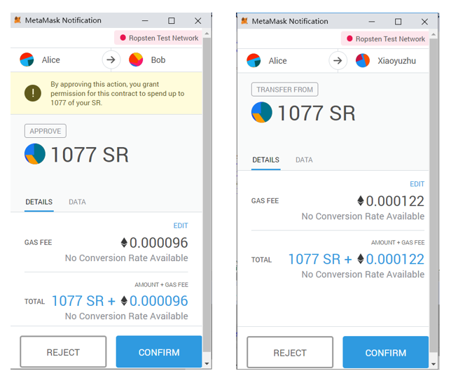
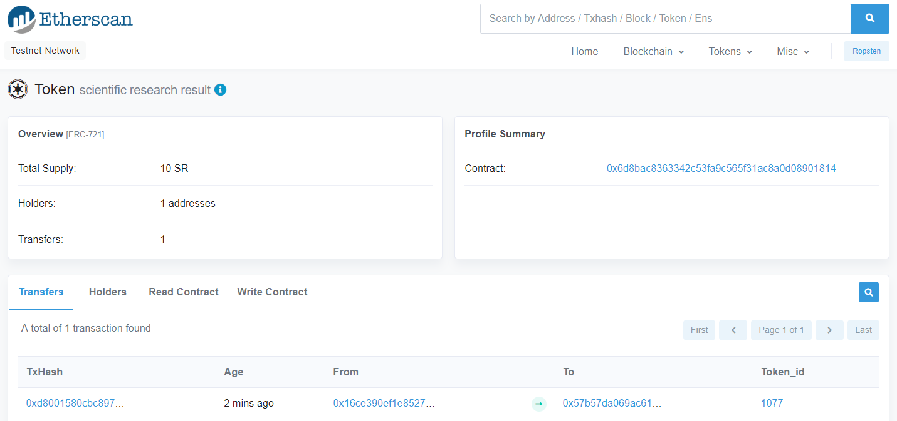
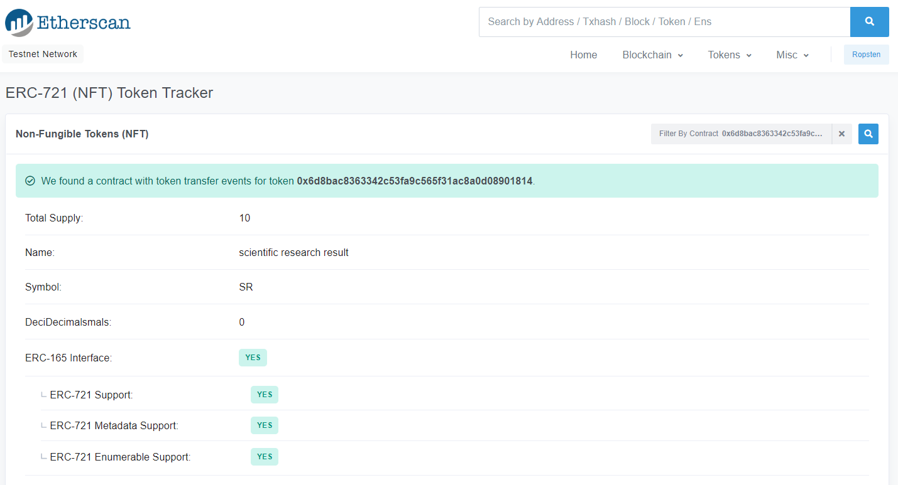

# Ethereum-ERC721
Issue NFT according to ERC721 standard

# ERC 721代币发行
注意事项：
1. 以下每一个合约中的接口都要定义，并且要通过实现ERC165定义的接口，来检测一个智能合约到底实现了什么接口的标准。只有完全检测到所有接口都以实现，发行的代币才会是ERC721代币。

合约包括：
* ERC165.sol
* ERC721.sol
* ERC721Metadata.sol
* ERC721Enumerable.sol


#### ERC165.sol

https://github.com/ethereum/EIPs/blob/master/EIPS/eip-165.md

ERC 165标准就是一种发布并能检测到一个智能合约实现了什么接口的标准，接口定义如下：
```
pragma solidity ^0.4.20;


interface ERC165 {
    function supportsInterface(bytes4 interfaceID) external view returns (bool);
}
```


#### ERC721.sol
https://github.com/ethereum/EIPs/blob/master/EIPS/eip-721.md

ERC721是一个定义了非同质代币(NFT-Non Fungible Tokens)的标准。

上面链接的官方文档中描述道：
> Every ERC-721 compliant contract must implement the ERC721 and ERC165 interfaces (subject to "caveats" below):  \
> 即：每一个符合ERC-721标准的合约都必须实现ERC721和ERC165接口(根据下面的“注意事项”):

```
pragma solidity ^0.4.20;

interface ERC721  {

    event Transfer(address indexed _from, address indexed _to, uint256 indexed _tokenId);
    event Approval(address indexed _owner, address indexed _approved, uint256 indexed _tokenId);
   
    event ApprovalForAll(address indexed _owner, address indexed _operator, bool _approved);

    function balanceOf(address _owner) external view returns (uint256);
    function ownerOf(uint256 _tokenId) external view returns (address);
    
    function safeTransferFrom(address _from, address _to, uint256 _tokenId, bytes data) external payable;
    function safeTransferFrom(address _from, address _to, uint256 _tokenId) external payable;
    //function transfer(address _to, uint256 _tokenId) external;
    function transferFrom(address _from, address _to, uint256 _tokenId) external payable;
    
    function approve(address _approved, uint256 _tokenId) external payable;
    function setApprovalForAll(address _operator, bool _approved) external;
    function getApproved(uint256 _tokenId) external view returns (address);
    function isApprovedForAll(address _owner, address _operator) external view returns (bool);
}
```
上面的ERC721合约中写的函数并不代表都必须要用，你可以根据自己的需求来选择某些方法。（值得注意的是：若在ERC721合约里包含了一些的接口，且你在Demo.sol中继承了ERC721合约，那么你必须在Demo.sol中实现ERC721中定义的所有接口，否则编译合约时会报错：“This contract does not implement all functions and thus cannot be created.”）

#### ERC721Metadata.sol
定义一些用NFT代表的数字资产的详细信息

```
pragma solidity ^0.4.20;


interface ERC721Metadata /* is ERC721 */ {
    /// @notice A descriptive name for a collection of NFTs in this contract
    //这个只是用于显示一些信息，比如你token的名字（name）等，可用可不用（option）
    function name() external view returns (string _name);

    /// @notice An abbreviated name for NFTs in this contract
    function symbol() external view returns (string _symbol);

    /// @notice A distinct Uniform Resource Identifier (URI) for a given asset.
    /// @dev Throws if `_tokenId` is not a valid NFT. URIs are defined in RFC
    ///  3986. The URI may point to a JSON file that conforms to the "ERC721
    ///  Metadata JSON Schema".
    function tokenURI(uint256 _tokenId) external view returns (string);
}
```

#### ERC721Metadata.sol
定义Token的总量、如何通过索引定位到Token，以及如何通过所有者和索引定位到Token


```
pragma solidity ^0.4.20;

interface ERC721Enumerable /* is ERC721 */ {
    /// @notice Count NFTs tracked by this contract
    /// @return A count of valid NFTs tracked by this contract, where each one of
    ///  them has an assigned and queryable owner not equal to the zero address
    function totalSupply() external view returns (uint256);

    /// @notice Enumerate valid NFTs
    /// @dev Throws if `_index` >= `totalSupply()`.
    /// @param _index A counter less than `totalSupply()`
    /// @return The token identifier for the `_index`th NFT,
    ///  (sort order not specified)
    function tokenByIndex(uint256 _index) external view returns (uint256);

    /// @notice Enumerate NFTs assigned to an owner
    /// @dev Throws if `_index` >= `balanceOf(_owner)` or if
    ///  `_owner` is the zero address, representing invalid NFTs.
    /// @param _owner An address where we are interested in NFTs owned by them
    /// @param _index A counter less than `balanceOf(_owner)`
    /// @return The token identifier for the `_index`th NFT assigned to `_owner`,
    ///   (sort order not specified)
    function tokenOfOwnerByIndex(address _owner, uint256 _index) external view returns (uint256);
}
```
提醒大家注意
1. 在新的合约中继承接口合约，并实现接口时，==要保持可见性一致以及可变性（Mutability）一致==。若接口中定义的是view，而你在合约中实现接口时用的是pure，则会报错。这是因为可变性担保是有强弱的。payable、Nonpayable、view、pure一次变弱。
2. 一个接口不能继承自另一个接口的
3. 接口中不可以定义变量，但是可以声明常量constant

https://github.com/ethereum/solidity/pull/3729

这里写了希望改进的有关override和overload的内容，还没有实现


#### 其他说明
Creating of NFTs ("minting") and destruction NFTs ("burning") is not included in the specification. Your contract may implement these by other means. Please see the event documentation for your responsibilities when creating or destroying NFTs.

NFT token是可以被销毁的

 

在这里使用ERC-165 Interface的目的：

We chose Standard Interface Detection (ERC-165) to expose the interfaces that a ERC-721 smart contract supports.

==就是用来发布这个NFT合约使用的接口。\
使用ERC721 接口的函数也是要实现ERC165的接口的==

具体代码见：


ERC721Demo.sol合约编译成功后，利用Remix在Ropsten测试链上进行部署。部署成功后，可执行授权和转让操作，并通过Matemask来确认操作，如下图所示。




最后，我们可以在Etherscan上查看我们发布的NFT,并可查看所有的转移记录。如下图。






本文参考文章如下：
1. https://www.cnblogs.com/wanghui-garcia/p/9507128.html
2. https://github.com/ethereum/EIPs/blob/master/EIPS/eip-721.md
